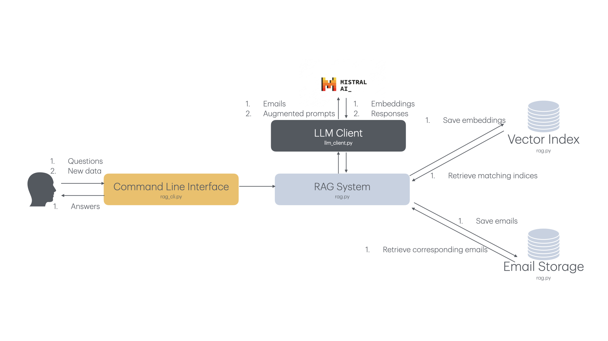

# Introduction
An AI assistant that helps navigate information in the ocean of emails leveraging Mistral AI API, 
and FAISS vector storage.
Some sample data are included for testing purpose. The data is a subset of 
[Enron email public dataset](https://www.kaggle.com/datasets/wcukierski/enron-email-dataset).

Overall design looks like below

# Installation and Quick Start
```bash
# Clone current repo
git clone https://github.com/SCAuFish/EmailRAG.git
cd EmailRAG
# Install required packages
poetry install
```
There are four operations supported in command line interface: bulk-add new emails in a jsonl file, add single email to 
the database, quit, or simply ask questions. Examples can be found below
```text
% myrag
2024-09-02 14:20:15,991 [rag.load_index:44] WARNING: Did not find index at path ./assets/index.pkl. Skipped loading
Welcome to Your Email Assistant! What would you like to do? Supported actions below
inc [filename]: Configure a jsonl file with your emails you'd like me to help with. Each line should contain 'from', 'to', and 'content' fields.
add [from] [to] [email content]: Share a new email that you'd like me to help with.
quit: Quit the program.
[Ask any question]: ask any question that are related to the emails.

(0) > inc assets/mini_sample_emails.jsonl

(30) > phone number of Kim?
Kim's phone number is 503-805-2117. (Reference: Email from Kim Ward to Phillip K Allen)
Most relevant documents: [3, 12, 21, 6, 10]

(30) > add Cheng Shen->Joe Biden: Looking forward to meeting you this Friday at 10AM!        

(31) > when's the interview with Biden?
The interview with Biden is on Friday at 10 AM. (Reference: Email from Cheng Shen to Joe Biden)
Most relevant documents: [30, 4, 17, 25, 3]

(31) > quit
```